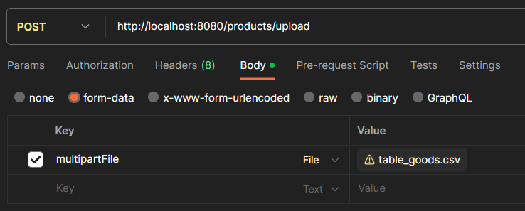

# KZVO CSV PARSER (based on JDBC-template)

This project provides a Java application for importing product data from a tab-delimited CSV file.

## Features

* **Parses single-column CSV files:** Utilizes tab characters as field delimiters.
* **Supports product data:** ID, name, price, and type.
* **Data validation:** Ensures proper data length and format.
* **Error handling:** Gracefully handles potential parsing issues.
* **Database storage:** Saves parsed data to a database (adapt for your preferred storage solution).

## How to Use

1. **Dependencies:** Ensure necessary Java libraries are installed.
2. **Configure DB:** Change credentials into `application.properties` to connect to your DB.
````java
    spring.datasource.url=jdbc:mysql://localhost:3306/kzvodb
    spring.datasource.username=root
    spring.datasource.password=admin
    spring.datasource.driver-class-name=com.mysql.cj.jdbc.Driver
````
3. **Run the application:** Execute the main method in the `CSVReaderApplication` class.
4. **Provide the CSV file:** Pass the csv file as an argument for example through a Postman.
   Below image with example:
   
5. **Monitor output:** Observe console logs and returning values for processing information and errors.

## Technical Details

* **Java version:** Compatible with chosen libraries (in our case 17)
* **Libraries:** Currently employs a custom reader, but can be modified to integrate with OpenCSV for increased functionality.
* **Data validation:** Basic checks for data length and format are implemented. You can extend these checks based on your specific requirements.
* **Database storage:** Uses a mock database (replace with your preferred database integration mechanism).
* **DAO layer** Uses JDBC-template to interact with DB.
